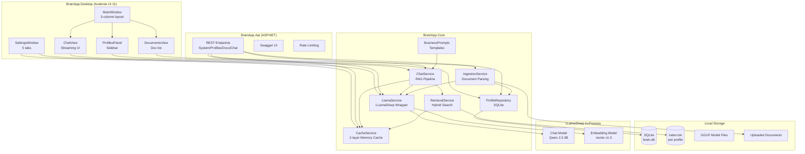
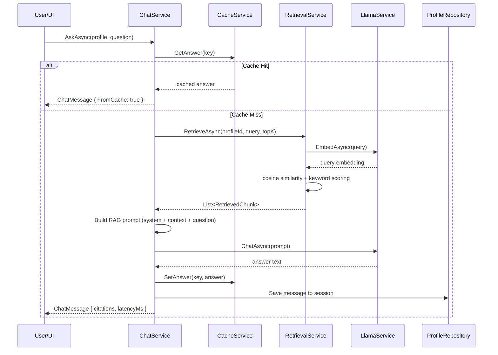

# BrainApp Implementation Plan

**Based on:** `BrainApp_AgentPrompt_v2.md`
**Solution:** 3-project .NET 8 solution — Core · API · Desktop
**UI Framework:** Avalonia UI 11 (cross-platform)
**LLM Runtime:** LLamaSharp (in-process GGUF inference, zero network)
**Storage:** SQLite via Microsoft.Data.Sqlite
**Target Platforms:** Windows (primary), macOS, Linux

---

## Solution Structure

```
BrainApp/
├── BrainApp.sln
├── models/                              ← GGUF files (gitignored)
│   ├── qwen2.5-3b-instruct-q4_k_m.gguf
│   ├── nomic-embed-text-v1.5.Q4_K_M.gguf
│   └── .gitkeep
├── appsettings.json                     ← shared config
├── MODELS.md                            ← GGUF download instructions
├── README.md
├── publish.sh / publish.ps1
├── src/
│   ├── BrainApp.Core/
│   │   ├── BrainApp.Core.csproj
│   │   ├── Config/AppSettings.cs
│   │   ├── Models/Models.cs
│   │   └── Services/
│   │       ├── CacheService.cs
│   │       ├── ChatService.cs
│   │       ├── IngestionService.cs
│   │       ├── LlamaService.cs
│   │       ├── ProfileRepository.cs
│   │       └── RetrievalService.cs
│   ├── BrainApp.Api/
│   │   ├── BrainApp.Api.csproj
│   │   └── Program.cs
│   └── BrainApp.Desktop/
│       ├── BrainApp.Desktop.csproj
│       ├── App.axaml / App.axaml.cs
│       ├── Assets/
│       ├── ViewModels/
│       │   ├── MainWindowViewModel.cs
│       │   ├── ChatViewModel.cs
│       │   ├── DocumentsViewModel.cs
│       │   └── SettingsViewModel.cs
│       └── Views/
│           ├── MainWindow.axaml / .cs
│           ├── ProfilesPanel.axaml
│           ├── ChatView.axaml
│           ├── DocumentsView.axaml
│           └── SettingsWindow.axaml
└── tests/
    └── BrainApp.Tests/
        ├── BrainApp.Tests.csproj
        ├── CacheServiceTests.cs
        └── RetrievalServiceTests.cs
```

---

## Phase 1 — Foundation, LLamaSharp Integration & Core Services

**Goal:** Solution compiles. LLamaSharp loads a GGUF model and produces output. All services implemented and unit-tested.

### 1.1 — Create solution scaffolding
- Create solution directory structure
- Create [`BrainApp.sln`](../BrainApp.sln) with 4 projects: Core, Api, Desktop, Tests
- Create all `.csproj` files with exact NuGet package references from the prompt
- Create [`appsettings.json`](../appsettings.json) with full config
- Create [`models/.gitkeep`](../models/.gitkeep)
- Create global `Directory.Build.props` (optional)

**Files to create:**
- [`src/BrainApp.Core/BrainApp.Core.csproj`](../src/BrainApp.Core/BrainApp.Core.csproj)
- [`src/BrainApp.Api/BrainApp.Api.csproj`](../src/BrainApp.Api/BrainApp.Api.csproj)
- [`src/BrainApp.Desktop/BrainApp.Desktop.csproj`](../src/BrainApp.Desktop/BrainApp.Desktop.csproj)
- [`tests/BrainApp.Tests/BrainApp.Tests.csproj`](../tests/BrainApp.Tests/BrainApp.Tests.csproj)
- [`appsettings.json`](../appsettings.json)
- [`models/.gitkeep`](../models/.gitkeep)

### 1.2 — Domain Models
- Create [`src/BrainApp.Core/Models/Models.cs`](../src/BrainApp.Core/Models/Models.cs) with all domain classes:
  - `Profile`, `ProfileStats`
  - `Document`, `DocumentType`, `DocumentStatus`
  - `DocumentChunk`
  - `ChatSession`, `ChatMessage`, `MessageRole`, `ChunkCitation`
  - `RetrievedChunk`
  - `ExtractionResult`

### 1.3 — Configuration
- Create [`src/BrainApp.Core/Config/AppSettings.cs`](../src/BrainApp.Core/Config/AppSettings.cs) with:
  - `LlamaSettings` — with `ResolvedModelsFolder`, `ResolvedChatModelPath`, `ResolvedEmbeddingModelPath` computed properties
  - `CacheSettings`
  - `RetrievalSettings`
  - `StorageSettings` — with `ResolvedAppDataFolder`
  - `ApiSettings`
  - `AppSettings` root class binding to `appsettings.json` sections
  - `ChatTemplate` enum: `Qwen`, `Llama3`, `Phi3`, `Gemma`, `Mistral`, `ChatML`

### 1.4 — LlamaService.cs (core service)
- Create [`src/BrainApp.Core/Services/LlamaService.cs`](../src/BrainApp.Core/Services/LlamaService.cs)
  - `InitializeAsync(ct)` — load chat + embedding GGUF weights in-process
  - `EmbedAsync(text, ct)` — compute L2-normalized embeddings with cache
  - `ChatAsync(systemPrompt, history, userMessage, ct)` — non-streaming
  - `ChatStreamAsync(systemPrompt, history, userMessage, ct)` — streaming via `IAsyncEnumerable<string>`
  - `BuildChatPrompt(system, history, userMsg)` — Qwen 2.5 format, switchable per `ChatTemplate`
  - `HealthCheckAsync()` → model status info
  - `GetModelInfo()` → `ModelInfo` record
  - `IsInitialized` property
  - `IAsyncDisposable` — clean up weights on shutdown
  - `SemaphoreSlim(1,1)` — thread safety for all inference
  - One `using` context per inference call
  - `EmbeddingMode = true` on embedding model

### 1.5 — CacheService.cs
- Create [`src/BrainApp.Core/Services/CacheService.cs`](../src/BrainApp.Core/Services/CacheService.cs)
  - Two-layer in-memory cache (embedding + query answer)
  - SHA-256 keyed, configurable TTL
  - Methods: `GetEmbedding`, `SetEmbedding`, `GetAnswer`, `SetAnswer`, `InvalidateProfile`, `GetStats()`
  - Generation counter per profile for cache invalidation

### 1.6 — IngestionService.cs
- Create [`src/BrainApp.Core/Services/IngestionService.cs`](../src/BrainApp.Core/Services/IngestionService.cs)
  - `IngestFileAsync(profileId, filePath, progress, ct)` → `(Document, List<DocumentChunk>)`
  - PDF parser (PdfPig), DOCX parser (OpenXml), HTML parser (HtmlAgilityPack), Markdown (Markdig→Html), TXT, Image (Tesseract OCR)
  - Fixed-size chunking (800 chars) with overlap (120 chars), sentence-boundary snapping
  - Embedding via `LlamaService.EmbedAsync` per chunk
  - Duplicate detection via SHA-256 hash

### 1.7 — RetrievalService.cs
- Create [`src/BrainApp.Core/Services/RetrievalService.cs`](../src/BrainApp.Core/Services/RetrievalService.cs)
  - In-memory index: `Dictionary<string, List<DocumentChunk>>`
  - `AddChunksAsync`, `RemoveDocumentAsync`, `ClearProfileAsync`, `ChunkCount`
  - `RetrieveAsync(profileId, query, topK, ct)` — hybrid semantic + keyword scoring
  - Cosine similarity for semantic (L2-normalized → dot product)
  - BM25-style token overlap for keyword
  - Final score: `0.7 * semantic + 0.3 * keyword`
  - `SaveIndexAsync(profileId)` → binary serialization to `index.bin`
  - `LoadIndexAsync(profileId)` → deserialize from `index.bin`

### 1.8 — ChatService.cs
- Create [`src/BrainApp.Core/Services/ChatService.cs`](../src/BrainApp.Core/Services/ChatService.cs)
  - `AskAsync(profile, session, question, ct)` — RAG pipeline with caching
  - `AskStreamAsync(profile, session, question, onCitations, ct)` — streaming with cache simulation
  - `ExtractJsonAsync(profile, question, jsonSchema, ct)` — structured JSON extraction
  - `GenerateDraftReplyAsync(profile, originalEmail, context, ct)` — email reply draft
  - History trimming to last 8 turns
  - Cache check → retrieve → build RAG prompt → inference → cache answer

### 1.9 — ProfileRepository.cs
- Create [`src/BrainApp.Core/Services/ProfileRepository.cs`](../src/BrainApp.Core/Services/ProfileRepository.cs)
  - SQLite-backed CRUD for profiles, documents, sessions
  - Tables: `profiles`, `documents`, `sessions` with JSON data columns
  - Methods: CRUD + `GetSessionHistory`, `GetDocumentByHash`, `SearchSessions`
  - DB path: `{AppDataFolder}/brain.db`

### 1.10 — Unit Tests
- Create [`tests/BrainApp.Tests/CacheServiceTests.cs`](../tests/BrainApp.Tests/CacheServiceTests.cs)
- Create [`tests/BrainApp.Tests/RetrievalServiceTests.cs`](../tests/BrainApp.Tests/RetrievalServiceTests.cs)
- Test cases per prompt specification

### Phase 1 completion check
```bash
dotnet build BrainApp.sln          # zero errors
dotnet test                        # all tests pass
```

---

## Phase 2 — REST API

**Goal:** All endpoints functional, Swagger at `/swagger`, model loads from file.

### 2.1 — Program.cs (ASP.NET host)
- Create [`src/BrainApp.Api/Program.cs`](../src/BrainApp.Api/Program.cs)
  - DI registration for all Core services
  - `LlamaService.InitializeAsync()` called at startup before accepting requests
  - Swagger with `X-Api-Key` security definition
  - Rate limiting via `AspNetCoreRateLimit`
  - Serilog configuration

### 2.2 — System endpoints
- `GET /health` — model status, GPU availability, initialization state
- `GET /model/info` — model details, estimated VRAM
- `GET /cache/stats` — cache configuration and status
- `DELETE /cache/{profileId}` — invalidate profile cache
- `POST /model/reload` — hot-swap GGUF weights

### 2.3 — Profile endpoints
- Full CRUD: `GET/POST/PUT/DELETE /profiles`
- `GET /profiles/{id}/stats`

### 2.4 — Document endpoints
- `POST /profiles/{id}/documents` — multipart file upload + ingest
- `GET /profiles/{id}/documents` — list documents
- `DELETE /profiles/{id}/documents/{docId}`
- `POST /profiles/{id}/documents/reindex` — 202 Accepted, background

### 2.5 — Chat endpoints
- `POST /profiles/{id}/chat` — ask question, optional `outputFormat`
- `GET /profiles/{id}/chat/stream` — Server-Sent Events streaming
- `GET /profiles/{id}/sessions` — last 20 sessions
- `GET /profiles/{id}/sessions/{sid}` — session with messages

### 2.6 — Extraction endpoint
- `POST /profiles/{id}/extract` — JSON extraction with schema

### 2.7 — Cross-profile query endpoint
- `POST /query` — query multiple profiles, union results

### 2.8 — Digest endpoint
- `POST /profiles/{id}/digest` — scheduled summary generation

### Phase 2 completion check
```bash
dotnet run --project src/BrainApp.Api
# Swagger at http://localhost:5199/swagger
# Full CRUD flow: create profile → upload doc → ask question → get cited answer
```

---

## Phase 3 — Avalonia Desktop UI

**Goal:** App runs on Windows, macOS, Linux. Full chat + document management.

### 3.1 — App host and startup
- Create/modify [`src/BrainApp.Desktop/App.axaml`](../src/BrainApp.Desktop/App.axaml) and [`App.axaml.cs`](../src/BrainApp.Desktop/App.axaml.cs)
  - DI host setup with all Core services
  - Loading window shown during `LlamaService.InitializeAsync()`
  - Splash screen with model info and indeterminate progress bar

### 3.2 — MainWindow layout (3-column)
- Create [`src/BrainApp.Desktop/Views/MainWindow.axaml`](../src/BrainApp.Desktop/Views/MainWindow.axaml)
- Create [`src/BrainApp.Desktop/Views/MainWindow.axaml.cs`](../src/BrainApp.Desktop/Views/MainWindow.axaml.cs)
- Toolbar: logo, profile name, model badge, settings button
- 3-column layout: Profile sidebar (200px) | Chat area (flex) | Documents panel (280px)

### 3.3 — ViewModels
- [`MainWindowViewModel.cs`](../src/BrainApp.Desktop/ViewModels/MainWindowViewModel.cs) — orchestrates panels
- [`ChatViewModel.cs`](../src/BrainApp.Desktop/ViewModels/ChatViewModel.cs) — messages, streaming, input, citations
- [`DocumentsViewModel.cs`](../src/BrainApp.Desktop/ViewModels/DocumentsViewModel.cs) — document list, upload, progress
- [`SettingsViewModel.cs`](../src/BrainApp.Desktop/ViewModels/SettingsViewModel.cs) — model, cache, storage, API, about tabs

### 3.4 — Profile sidebar
- [`ProfilesPanel.axaml`](../src/BrainApp.Desktop/Views/ProfilesPanel.axaml)
  - Scrollable profile list with color badge, name, doc/chunk count
  - Create/edit/delete profiles (right-click context menu)
  - Model status chip (ready/loading/not found)
  - System resource indicator

### 3.5 — Chat view
- [`ChatView.axaml`](../src/BrainApp.Desktop/Views/ChatView.axaml)
  - Message bubbles: user right-aligned, assistant left-aligned
  - Streaming token-by-token via `Dispatcher.UIThread.InvokeAsync`
  - Collapsible citations panel with filename chips and tooltip excerpts
  - Multiline input (Enter send, Shift+Enter newline)
  - Send/Stop buttons, loading state management
  - `[New chat]`, `[Export]`, `[Digest ▾]` buttons in header
  - Empty state with example questions

### 3.6 — Documents panel
- [`DocumentsView.axaml`](../src/BrainApp.Desktop/Views/DocumentsView.axaml)
  - Document list with type icon, filename, size, status badge
  - `[+ Add documents]` via `StorageProvider.OpenFilePickerAsync`
  - Drag-and-drop support
  - Per-file ingest progress bar
  - Duplicate detection with toast notification
  - "Reindex all" button

### 3.7 — Settings window
- [`SettingsWindow.axaml`](../src/BrainApp.Desktop/Views/SettingsWindow.axaml)
  - **Model tab:** file paths, context size, GPU layers, threads, chat template dropdown, test/reload buttons
  - **Cache tab:** toggles, TTL sliders, clear button
  - **Storage tab:** AppData path, max file size, max docs
  - **API tab:** enable toggle, port, key, Swagger toggle
  - **About tab:** version, links, model file validation

### 3.8 — MODELS.md
- Create [`MODELS.md`](../MODELS.md) with download instructions, model table, chat templates guide

### Phase 3 completion check
```bash
dotnet run --project src/BrainApp.Desktop
# Loading screen → 3-column layout → create profile → add doc → ask question → streaming answer → citations
```

---

## Phase 4 — Business Features, Polish & Packaging

**Goal:** All business-specific features working. App is production-ready.

### 4.1 — BusinessPrompts.cs
- Create [`src/BrainApp.Core/Services/BusinessPrompts.cs`](../src/BrainApp.Core/Services/BusinessPrompts.cs)
  - Static class with named prompt templates:
    - `ProjectStatus`, `OpenActionItems`, `UpcomingDeadlines`
    - `ContractClauseSearch`, `OverdueInvoices`, `RevenueByClient`
    - `UnansweredQuestions`, `WeeklyDigest`, `DraftReply`, `SentimentShift`
  - Quick Action chips in chat UI above input

### 4.2 — JSON extraction in UI
- Extract mode toggle in chat header
- Schema input text area
- Formatted JSON output with syntax highlighting
- Copy-to-clipboard button

### 4.3 — Profile edit dialog
- [`ProfileEditDialog.axaml`](../src/BrainApp.Desktop/Views/ProfileEditDialog.axaml)
  - Name, description, color picker (12 swatches + custom hex)
  - System prompt editor with reset to default
  - Model override dropdown from GGUF files in models folder

### 4.4 — Export features
- Chat export to Markdown via `StorageProvider.SaveFilePickerAsync`
- Profile export to `.brainzip` (docs + metadata JSON)
- Profile import from `.brainzip` with re-ingestion progress

### 4.5 — Global hotkey overlay
- `Ctrl+Shift+B` to open compact floating window
- Profile selector, question input, inline answer
- `Escape` to dismiss
- Platform-specific: `RegisterHotKey` on Windows, Carbon on macOS

### 4.6 — Notification service
- Toast notifications via Avalonia `WindowNotificationManager`
- Events: ingestion complete, duplicate skip, model errors, cache cleared, API errors

### 4.7 — Publish scripts
- [`publish.sh`](../publish.sh) — bash script for all platforms
- [`publish.ps1`](../publish.ps1) — PowerShell script
- Targets: `win-x64`, `osx-arm64`, `osx-x64`, `linux-x64`
- Self-contained publishing

### 4.8 — README.md
- Create [`README.md`](../README.md) covering:
  - Prerequisites, model setup (prominent), how to change model
  - Quick start, API reference, business use cases
  - Troubleshooting guide for common issues

### Phase 4 completion check
```bash
dotnet build BrainApp.sln           # zero errors
dotnet test                         # all tests pass
dotnet publish src/BrainApp.Desktop -r win-x64 --self-contained
# Full integration test: launch, load model, index PDF, Quick Actions, digest, export, settings
```

---

## Architecture Diagram



## Data Flow — RAG Query



---

## Key Design Decisions (documented inline)

| Decision | Choice | Rationale |
|----------|--------|-----------|
| LLM runtime | LLamaSharp in-process | Zero network, fully offline, no Ollama dependency |
| UI framework | Avalonia UI 11 | True cross-platform (WPF/Mac/Linux), not MAUI |
| Storage | SQLite + binary index | Portable, no server process, embedded |
| Embedding cache | SHA-256 keyed, 24h TTL | Same text → same vector; skip recomputation |
| Query cache | Generation-counter invalidated | Instant repeated answers, per-profile invalidation |
| Hybrid search | 70% semantic + 30% keyword | BM25 catches keyword matches cosine misses |
| Thread safety | SemaphoreSlim(1,1) | LLamaSharp contexts are not thread-safe |
| Chunking | 800 chars, 120 overlap, sentence-snapped | Balances context density with natural boundaries |
| Chat template | Switchable via enum | Different model families use different formats |
